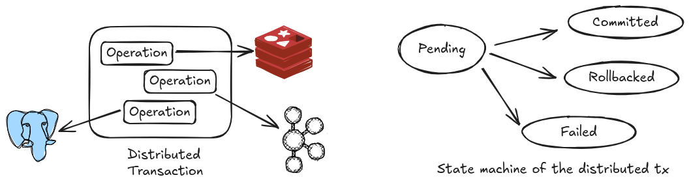
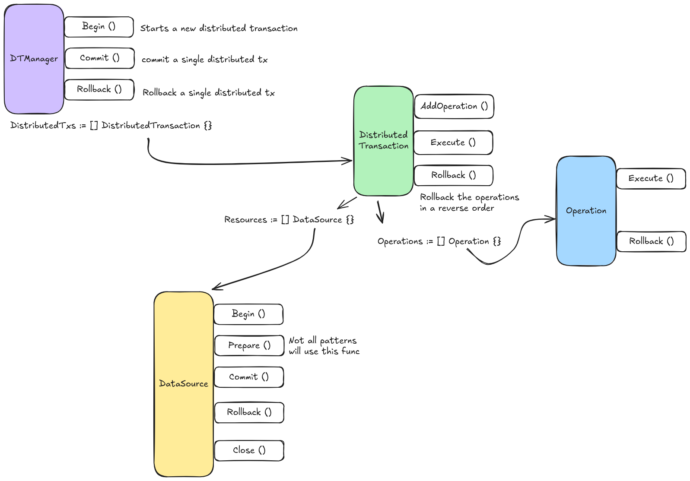

# DTGO - Distributed Transaction Framework for Go

DTGO is a flexible and extensible distributed transaction framework for Go that supports multiple patterns and data sources. It provides a seamless way to implement distributed transactions across different databases and message queues.

## Features (Planned)

- Support for multiple distributed transaction patterns:
  - Two-Phase Commit (2PC)
  - Saga Pattern
  - Try-Confirm/Cancel (TCC)
  - Outbox/Inbox Pattern

- Supported Data Sources:
  - PostgreSQL
  - MongoDB
  - Redis
  - Apache Kafka

## Project Structure

```
dtgo/
├── pkg/
│   ├── dtx/          # Core distributed transaction package
│   ├── drivers/      # Data source specific implementations
│   └── patterns/     # Transaction patterns implementations
├── examples/         # Example usage of the package
└── internal/         # Internal utilities and helpers
```

## Design 
### 1. Distributed Tx consists of multiple operations (transactions), and this is the state machine of the distrubted TX across the system



### 2. Modules Architecture :

